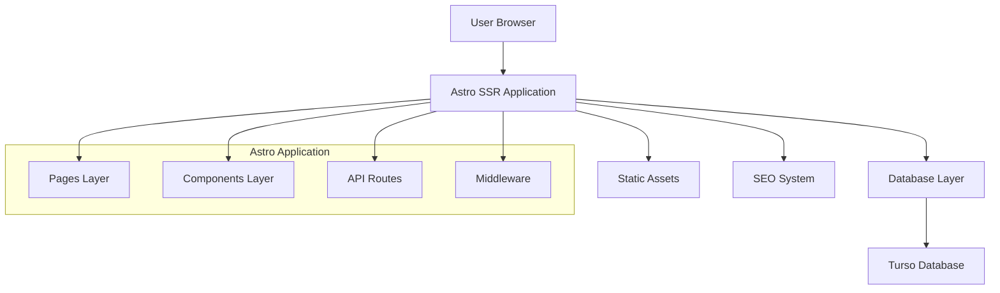

# Design Document: Gambling Directory Engine

## Overview

The Gambling Directory Engine is a server-side rendered (SSR) Astro application that provides a comprehensive directory platform for gambling establishments. The system leverages Astro's SSR capabilities to deliver SEO-optimized pages while maintaining excellent performance through efficient database queries and caching strategies.

The architecture follows a modern web development approach using Astro for SSR, Turso as the distributed SQLite database, Tailwind CSS 4 for styling, and DaisyUI for component consistency. The system is designed to handle large datasets efficiently while providing rich search and filtering capabilities.

## Architecture

### High-Level Architecture



### Technology Stack

- **Frontend Framework**: Astro with SSR enabled
- **Database**: Turso (distributed SQLite)
- **Styling**: Tailwind CSS 4 + DaisyUI
- **Language**: TypeScript
- **Deployment**: Server-side rendering with adapter support

### Data Flow

1. **Request Processing**: Astro receives page requests and processes them server-side
2. **Database Queries**: Efficient SQL queries to Turso database with proper joins
3. **Data Transformation**: Raw database data transformed into presentation models
4. **Template Rendering**: Astro components render HTML with embedded data
5. **Response Delivery**: Optimized HTML delivered to client with SEO metadata

## Components and Interfaces

### Database Layer

**Astro DB Configuration with Turso**
```typescript
// astro.config.mjs
import { defineConfig } from 'astro/config';

export default defineConfig({
  output: 'server', // Enable SSR
  // Astro DB will automatically connect to Turso using environment variables
});
```

**Environment Variables Setup**
```bash
# .env
ASTRO_DB_REMOTE_URL=libsql://your-database-name.turso.io
ASTRO_DB_APP_TOKEN=your-turso-auth-token
```

**Database Service Interface using Astro DB**
```typescript
// src/lib/database.ts
import { db, eq, like, and, or, count, desc, asc } from 'astro:db';
import type { Business, Category, Amenity, Region } from './types';

interface DatabaseService {
  getBusinesses(filters: BusinessFilters, pagination: Pagination): Promise<BusinessResult[]>
  getBusinessBySlug(slug: string): Promise<BusinessDetail | null>
  getCategories(): Promise<Category[]>
  getAmenities(): Promise<Amenity[]>
  getRegions(): Promise<Region[]>
  searchBusinesses(query: string, filters: BusinessFilters): Promise<BusinessResult[]>
}

export class TursoDatabase implements DatabaseService {
  async getBusinesses(filters: BusinessFilters, pagination: Pagination): Promise<BusinessResult[]> {
    let query = db.select().from(Business).where(eq(Business.is_active, true));
    
    // Apply filters
    if (filters.categories?.length) {
      query = query.innerJoin(BusinessCategory, eq(Business.id, BusinessCategory.business_id))
                   .where(and(
                     eq(Business.is_active, true),
                     or(...filters.categories.map(id => eq(BusinessCategory.category_id, id)))
                   ));
    }
    
    // Apply pagination and sorting
    query = query.orderBy(desc(Business.featured), desc(Business.rating))
                 .limit(pagination.limit)
                 .offset(pagination.offset);
    
    return await query;
  }

  async getBusinessBySlug(slug: string): Promise<BusinessDetail | null> {
    const business = await db.select()
      .from(Business)
      .where(and(eq(Business.slug, slug), eq(Business.is_active, true)))
      .limit(1);
    
    if (!business.length) return null;
    
    // Get related data using joins
    const categories = await db.select()
      .from(Category)
      .innerJoin(BusinessCategory, eq(Category.id, BusinessCategory.category_id))
      .where(eq(BusinessCategory.business_id, business[0].id));
    
    return { ...business[0], categories };
  }
}
```

### Business Models

**Core Business Types**
```typescript
interface Business {
  id: number
  cid: string
  name: string
  slug: string
  rating: number
  reviews_count: number
  full_address: string
  city: string
  state: string
  zip_code: string
  phone: string
  website: string
  image_url: string
  lat: number
  lng: number
  maps_url: string
  business_type: string
  description: string
  is_active: boolean
  featured: boolean
  verified: boolean
  meta_title: string
  meta_description: string
  created_at: string
  updated_at: string
}

interface BusinessWithRelations extends Business {
  categories: Category[]
  amenities: Amenity[]
  regions: Region[]
}
```

### Page Components

**Business Listing Component**
```astro
---
// src/components/BusinessCard.astro
interface Props {
  business: BusinessResult
}
const { business } = Astro.props
---

<div class="card bg-base-100 shadow-xl">
  <figure>
    
  </figure>
  <div class="card-body">
    <h2 class="card-title">
      {business.name}
      {business.verified && <div class="badge badge-primary">Verified</div>}
      {business.featured && <div class="badge badge-secondary">Featured</div>}
    </h2>
    <div class="rating rating-sm">
      <!-- Rating stars implementation -->
    </div>
    <p>{business.description}</p>
    <div class="card-actions justify-end">
      <a href={`/business/${business.slug}`} class="btn btn-primary">View Details</a>
    </div>
  </div>
</div>
```

### Search and Filter System

**Filter Interface**
```typescript
interface BusinessFilters {
  categories?: number[]
  amenities?: number[]
  regions?: number[]
  city?: string
  state?: string
  rating_min?: number
  featured_only?: boolean
  verified_only?: boolean
}

interface SearchParams extends BusinessFilters {
  query?: string
  page?: number
  limit?: number
  sort?: 'name' | 'rating' | 'reviews_count' | 'created_at'
  order?: 'asc' | 'desc'
}
```

## Data Models

### Database Schema Integration

The system integrates with the existing Turso database schema using Astro DB's Drizzle ORM:

**Schema Definition**
```typescript
// db/config.ts
import { defineDb, defineTable, column } from 'astro:db';

const Business = defineTable({
  columns: {
    id: column.number({ primaryKey: true }),
    cid: column.text(),
    name: column.text({ notNull: true }),
    slug: column.text({ unique: true }),
    rating: column.number(),
    reviews_count: column.number({ default: 0 }),
    full_address: column.text(),
    city: column.text(),
    state: column.text(),
    zip_code: column.text(),
    phone: column.text(),
    website: column.text(),
    image_url: column.text(),
    lat: column.number(),
    lng: column.number(),
    maps_url: column.text(),
    business_type: column.text(),
    description: column.text(),
    is_active: column.boolean({ default: true }),
    featured: column.boolean({ default: false }),
    verified: column.boolean({ default: false }),
    meta_title: column.text(),
    meta_description: column.text(),
    created_at: column.date({ default: new Date() }),
    updated_at: column.date({ default: new Date() })
  }
});

const Category = defineTable({
  columns: {
    id: column.number({ primaryKey: true }),
    name: column.text({ unique: true, notNull: true }),
    slug: column.text({ unique: true, notNull: true }),
    is_active: column.boolean({ default: true })
  }
});

const BusinessCategory = defineTable({
  columns: {
    business_id: column.number({ references: () => Business.columns.id }),
    category_id: column.number({ references: () => Category.columns.id })
  }
});

export default defineDb({
  tables: { Business, Category, BusinessCategory, /* ... other tables */ }
});
```

### Query Optimization with Astro DB

**Efficient Business Queries using Drizzle ORM**
```typescript
// Optimized business listing with relations
async function getBusinessListings(filters: BusinessFilters) {
  return await db.select({
    business: Business,
    categories: {
      id: Category.id,
      name: Category.name,
      slug: Category.slug
    }
  })
  .from(Business)
  .leftJoin(BusinessCategory, eq(Business.id, BusinessCategory.business_id))
  .leftJoin(Category, and(
    eq(BusinessCategory.category_id, Category.id),
    eq(Category.is_active, true)
  ))
  .where(eq(Business.is_active, true))
  .orderBy(desc(Business.featured), desc(Business.rating))
  .limit(filters.limit)
  .offset(filters.offset);
}

// Search with full-text capabilities
async function searchBusinesses(query: string) {
  return await db.select()
    .from(Business)
    .where(and(
      eq(Business.is_active, true),
      or(
        like(Business.name, `%${query}%`),
        like(Business.description, `%${query}%`),
        like(Business.full_address, `%${query}%`)
      )
    ))
    .orderBy(desc(Business.featured), desc(Business.rating));
}
```

### Caching Strategy

**Astro DB Caching**
- Astro DB automatically handles connection pooling and query optimization
- Use Astro's built-in caching for static pages and components
- Implement page-level caching for dynamic content with reasonable TTL

**Development vs Production**
```typescript
// Development: Local database file
// astro dev (uses local db/seed.ts data)

// Production: Remote Turso database  
// astro build --remote (connects to Turso)

// Environment-specific configuration
const isDev = import.meta.env.DEV;
const dbConfig = {
  // Astro DB handles connection automatically based on environment
  remote: !isDev // Use remote DB in production
};
```

## Correctness Properties

*A property is a characteristic or behavior that should hold true across all valid executions of a system—essentially, a formal statement about what the system should do. Properties serve as the bridge between human-readable specifications and machine-verifiable correctness guarantees.*

Based on the prework analysis, the following properties validate the system's correctness:

### Property 1: Active Business Display
*For any* business dataset containing both active and inactive businesses, the directory listing should display only businesses where is_active=true, and pagination should work correctly across all active businesses.
**Validates: Requirements 1.1, 1.5**

### Property 2: Required Business Information Display
*For any* business listing, the displayed information should include business name, rating, review count, address, and primary image when these fields are available.
**Validates: Requirements 1.2**

### Property 3: Featured Business Prominence
*For any* search result set containing both featured and non-featured businesses, featured businesses should appear before non-featured businesses in the results.
**Validates: Requirements 1.3**

### Property 4: Verification Badge Display
*For any* business with verified=true, the listing should display a verification badge, while businesses with verified=false should not display the badge.
**Validates: Requirements 1.4**

### Property 5: Multi-field Search Functionality
*For any* search query and business dataset, the search should find businesses where the query matches content in business names, descriptions, or addresses.
**Validates: Requirements 2.1**

### Property 6: Category Filtering
*For any* selected category filter and business dataset, the results should include only businesses that are associated with the selected categories.
**Validates: Requirements 2.2, 7.4**

### Property 7: Amenity Filtering
*For any* selected amenity filter and business dataset, the results should include only businesses that offer the selected amenities.
**Validates: Requirements 2.3**

### Property 8: Region Filtering
*For any* selected region filter and business dataset, the results should include only businesses that are located in the selected regions.
**Validates: Requirements 2.4, 8.4**

### Property 9: Multiple Filter Combination
*For any* combination of category, amenity, and region filters applied simultaneously, the results should include only businesses that match ALL selected criteria (AND logic).
**Validates: Requirements 2.5**

### Property 10: Location-based Search
*For any* city or state search query, the search should return businesses located in the specified geographic area.
**Validates: Requirements 2.6**

### Property 11: Business Profile Navigation
*For any* business listing, clicking on it should navigate to the correct detailed profile page for that specific business.
**Validates: Requirements 3.1**

### Property 12: Complete Profile Information Display
*For any* business profile page, all available business information (description, contact details, location data) should be displayed when present in the database.
**Validates: Requirements 3.2**

### Property 13: Category Tags Display
*For any* business with associated categories, the profile page should display those categories as organized tags.
**Validates: Requirements 3.3**

### Property 14: Amenity Grouping Display
*For any* business with associated amenities, the profile page should display amenities grouped by their category.
**Validates: Requirements 3.4**

### Property 15: Map Display for Location Data
*For any* business with latitude and longitude data, the profile page should display an embedded map.
**Validates: Requirements 3.5**

### Property 16: SEO-friendly URL Structure
*For any* business profile page, the URL should use the business slug in an SEO-friendly format.
**Validates: Requirements 3.6, 4.4**

### Property 17: Custom SEO Metadata Usage
*For any* business with custom meta_title and meta_description fields, the profile page should use these custom values in the HTML metadata.
**Validates: Requirements 4.1**

### Property 18: Fallback SEO Metadata Generation
*For any* business without custom meta_title or meta_description, the system should generate appropriate titles and descriptions from the business name and description.
**Validates: Requirements 4.2**

### Property 19: Structured Data Markup
*For any* business profile page, the HTML should include proper structured data markup for search engines.
**Validates: Requirements 4.3**

### Property 20: Open Graph Tags
*For any* business profile page, the HTML should include appropriate Open Graph tags for social media sharing.
**Validates: Requirements 4.5**

### Property 21: Pagination Functionality
*For any* large dataset of businesses, the pagination system should correctly divide results into pages and allow navigation between pages.
**Validates: Requirements 5.4**

### Property 22: Database Error Handling
*For any* database connection error or query failure, the system should handle the error gracefully without crashing.
**Validates: Requirements 6.5**

### Property 23: Active Categories Display
*For any* category dataset, the directory should display all categories where is_active=true as browsable sections.
**Validates: Requirements 7.1**

### Property 24: Accurate Count Display
*For any* category or region, the displayed business count should match the actual number of active businesses associated with that category or region.
**Validates: Requirements 7.2, 8.2**

### Property 25: Amenity Category Grouping
*For any* set of amenities, they should be grouped by their category field for organized display.
**Validates: Requirements 7.3**

### Property 26: SEO-friendly Category and Region Pages
*For any* category or region, the system should create SEO-friendly landing pages with appropriate URL structure.
**Validates: Requirements 7.5, 8.3**

### Property 27: Regional Organization Display
*For any* business dataset, businesses should be properly organized and displayed by their associated regions and states.
**Validates: Requirements 8.1**

### Property 28: Hierarchical Navigation
*For any* geographic hierarchy (state → region → business), the navigation should allow users to browse from broader to more specific geographic areas.
**Validates: Requirements 8.5**

<function_calls>
<invoke name="prework">
<parameter name="featureName">gambling-directory-engine

## Error Handling

### Database Connection Errors
- Graceful degradation when Turso database is unavailable
- Retry logic with exponential backoff for transient failures
- Fallback to cached data when possible
- User-friendly error messages for persistent failures

### Data Validation
- Input sanitization for search queries and filters
- Validation of business data before display
- Handling of missing or malformed business information
- Protection against SQL injection through parameterized queries

### Image Loading Errors
- Fallback images for missing business photos
- Lazy loading with error handling
- Optimized image formats and sizes
- CDN failover mechanisms

### SEO Error Handling
- Default metadata when custom values are invalid
- Structured data validation
- Canonical URL generation
- Sitemap error recovery

## Testing Strategy

### Dual Testing Approach

The system will employ both unit testing and property-based testing to ensure comprehensive coverage:

**Unit Tests**: Verify specific examples, edge cases, and error conditions
- Test specific business data scenarios
- Validate component rendering with known inputs
- Test error conditions and edge cases
- Integration points between components

**Property Tests**: Verify universal properties across all inputs
- Test correctness properties with randomized data
- Validate system behavior across large input spaces
- Ensure properties hold for all valid business combinations
- Comprehensive input coverage through randomization

### Property-Based Testing Configuration

**Framework**: Use `fast-check` library for TypeScript property-based testing
**Test Configuration**: Minimum 100 iterations per property test
**Test Tagging**: Each property test must reference its design document property using the format:
`**Feature: gambling-directory-engine, Property {number}: {property_text}**`

**Example Property Test Structure**:
```typescript
import fc from 'fast-check';

describe('Business Directory Properties', () => {
  it('Property 1: Active Business Display', () => {
    // **Feature: gambling-directory-engine, Property 1: Active Business Display**
    fc.assert(fc.property(
      businessDatasetArbitrary(),
      (businesses) => {
        const results = getBusinessListings(businesses);
        return results.every(business => business.is_active === true);
      }
    ), { numRuns: 100 });
  });
});
```

### Testing Coverage Areas

**Core Functionality Testing**:
- Business listing and filtering logic
- Search functionality across multiple fields
- Pagination and sorting mechanisms
- SEO metadata generation

**Integration Testing**:
- Database query execution and result processing
- Component rendering with real data
- URL routing and navigation
- Error handling scenarios

**Performance Testing**:
- Large dataset handling
- Query optimization validation
- Caching effectiveness
- Image loading performance

### Test Data Generation

**Smart Generators**: Create intelligent test data generators that:
- Generate realistic business data within valid constraints
- Create varied category, amenity, and region combinations
- Produce edge cases like missing optional fields
- Simulate real-world data distributions

**Database Test Setup**:
- In-memory SQLite for fast test execution
- Seed data generation for consistent test scenarios
- Transaction rollback for test isolation
- Mock Turso client for unit tests